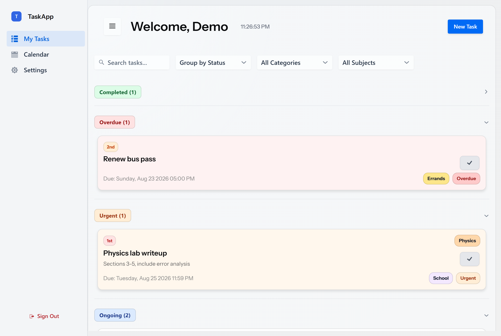

# TaskApp (Multitask v1)

The initial version of [Multitask](https://github.com/jckyii/MultiTask)—the web-based task manager which I designed, built, and put into action as my first full-stack project (from April to June 2026)—is still currently active and continues to serve its original users.

> 🔗 **Live app:** https://taskmanager-gcvv.onrender.com · **The successor (v2)** is [jckyii/MultiTask](https://github.com/jckyii/MultiTask) — a completely native and offline-first version of this product.

<p align="center">
  
</p>

## What it does

- Tasks include a title, description, due date and time, **category**, **subject**, and an optional **priority tier** (1st / 2nd / 3rd).
- All tasks have a current **status**—Ongoing, Urgent, Overdue, or Completed—and this status is calculated according to the user's timezone. A task is considered Urgent if it is due within the threshold, which is a setting specific to each user (ranging from 1 to 720 hours, with the default being 48 hours).
- The entire user interface is based on status: this includes white, orange, red, and green card backgrounds, status badges, and coloured pills indicating the category and subject.
- The list can be **divided into five categories** (status, date, subject, category, priority), and it can be searched as you type with the ability to filter by category or subject; completed tasks are kept in a collapsed section at the top.
- **Users set up categories and subjects**, each of which has a colour picker; if one is deleted it is removed from all tasks and a confirmation is required.
- The **FullCalendar month calendar** displays tasks with dates indicated by colour; when you click on a day, a list of the tasks for that day appears, and if you click on an item, the edit dialog box appears in place.
- The system provides accounts using an email address and a **password that is hashed with BCrypt**; it includes **email verification links** (which are single-use tokens valid for 24 hours and can be resent); it requires re-authentication before allowing any sensitive changes; when an email address is changed, the change is confirmed from the new email address; and it includes a remember-me cookie. Each query is restricted to the logged-in user.
- **The settings include** a display name, an email address, a password, an urgency threshold, and a searchable time zone picker (together with a banner that provides the option to update it when your browser detects a different time zone).

## Stack

Java 24 · Spring Boot 4 · Vaadin Flow 25 (server-rendered UI) · Spring Security · Spring Data JPA / Hibernate · PostgreSQL on Supabase · Spring Mail (verification emails) · Docker → deployed on Render.

## Numbers

~4,600 lines of Java · 65 commits across 14 pull requests over two months · 3 database tables · 8 routes.

## Why it was rebuilt

Using it every day revealed three limitations: it only functioned online, the server-rendered framework hindered the kind of interaction design I desired, and a task manager is really meant to be used on a phone. The revamped version was called [Multitask v2](https://github.com/jckyii/MultiTask) — it used the same database and shared the same product DNA (the status colours and pills you see above first appeared here) and was completely redesigned as a native, offline-first application. Accounts from version 1 can log into version 2 with the same email and their tasks are automatically carried over.

## Running it locally

```bash
./mvnw    # starts Spring Boot + Vaadin dev mode on :8080
```

Requires environment variables for the database and mailer: `DB_URL`, `DB_USER`, `DB_PASSWORD` (Postgres — use Supabase's transaction-mode pooler), `MAIL_USERNAME`, `MAIL_PASSWORD` (a Gmail app password), and optionally `APP_BASE_URL` so verification emails link to the right host.
